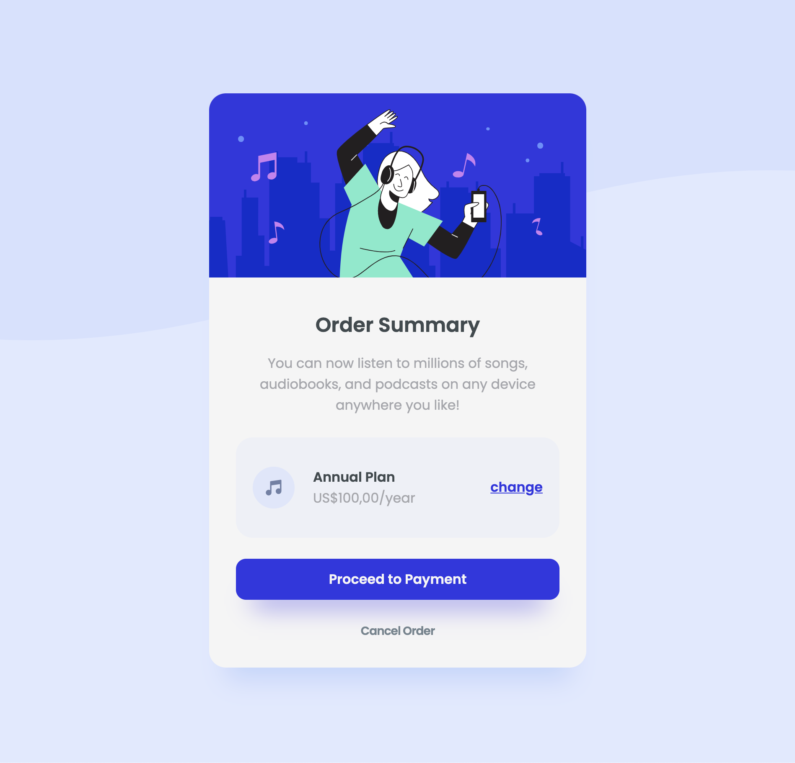

<h1 align="center">Order summary component</h1>

Card simples criado com React, TypeScript e Styled Components conforme layout previamente estabelecido

:coffee:

---

  

<h2>Status</h2>
Finalizada  

<h2>Tecnologias utilizadas</h2>
- TypeScript 
- React 
- Styled Components  

<h2>Imagem</h2>

| Card |
|-------|
||

  
<h3>Layout</h3>
<a href="https://www.frontendmentor.io/">Frontend Mentor</a>